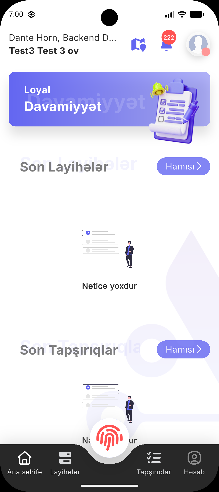

# arbinex_bottom_bar

`arbinex_bottom_bar` is a customizable Flutter bottom navigation bar with a center action button, notch controls, spacing controls, and multiline label support.

## Features

- Custom bottom bar items with icon and label
- Separate center action slot
- Controlled and uncontrolled active index support
- Custom colors, shadows, sizing, and notch controls
- Multiline label support with configurable `maxLines` and overflow
- Safe area and bottom inset controls
- Automatic height calculation when `height` is not provided

## Installation

Add the package to your `pubspec.yaml`:

```yaml
dependencies:
  arbinex_bottom_bar: ^0.1.0
```

Then run:

```bash
flutter pub get
```

## Quick start

Basic stateful usage:

```dart
import 'package:arbinex_bottom_bar/arbinex_bottom_bar.dart';
import 'package:flutter/material.dart';

class HomeScreen extends StatefulWidget {
  const HomeScreen({super.key});

  @override
  State<HomeScreen> createState() => _HomeScreenState();
}

class _HomeScreenState extends State<HomeScreen> {
  int currentIndex = 0;

  @override
  Widget build(BuildContext context) {
    return Scaffold(
      bottomNavigationBar: ArbinexBottomBar(
        currentIndex: currentIndex,
        onTap: (index) {
          setState(() => currentIndex = index);
        },
        centerAction: const BottomActionBarCenterItem(
          child: Icon(Icons.fingerprint),
        ),
        items: const [
          BottomActionBarItem(
            icon: Icon(Icons.home_rounded),
            label: 'Home',
          ),
          BottomActionBarItem(
            icon: Icon(Icons.work_outline_rounded),
            label: 'Projects',
          ),
          BottomActionBarItem(
            icon: Icon(Icons.task_alt_rounded),
            label: 'Tasks',
          ),
          BottomActionBarItem(
            icon: Icon(Icons.person_outline_rounded),
            label: 'Profile',
          ),
        ],
      ),
    );
  }
}
```

## Advanced customization

Use explicit colors, spacing, notch controls, label behavior, and center action styling:

```dart
import 'package:arbinex_bottom_bar/arbinex_bottom_bar.dart';
import 'package:flutter/material.dart';

int currentIndex = 0;

ArbinexBottomBar(
  currentIndex: currentIndex,
  initialActiveIndex: 0,
  backgroundColor: const Color(0xFF252525),
  horizontalPadding: 12,
  itemVerticalPadding: const EdgeInsets.fromLTRB(8, 8, 8, 10),
  itemTopPadding: 8,
  itemBottomPadding: 10,
  activeColor: Colors.white,
  inactiveColor: const Color(0xFF8F8F8F),
  borderRadius: const BorderRadius.vertical(
    top: Radius.circular(28),
  ),
  shadow: const [
    BoxShadow(
      color: Color(0x22000000),
      blurRadius: 24,
      offset: Offset(0, -6),
    ),
  ],
  notchMargin: 10,
  notchDepth: 28,
  itemSpacing: 4,
  minimumBottomInset: 0,
  onTap: (index) {
    debugPrint('Selected index: $index');
  },
  centerAction: BottomActionBarCenterItem(
    top: -10,
    centerActionGap: 0,
    size: 68,
    backgroundColor: Colors.white,
    borderColor: Color(0xFFE5E7FF),
    borderWidth: 1,
    child: Icon(Icons.fingerprint),
  ),
  items: const [
    BottomActionBarItem(
      icon: Icon(Icons.home_rounded),
      label: 'Home',
    ),
    BottomActionBarItem(
      icon: Icon(Icons.work_outline_rounded),
      label: 'Projects',
    ),
    BottomActionBarItem(
      icon: Icon(Icons.task_alt_rounded),
      label: 'Tasks',
      labelMaxLines: 2,
      labelSoftWrap: true,
    ),
    BottomActionBarItem(
      icon: Icon(Icons.person_outline_rounded),
      label: 'Profile',
    ),
  ],
)
```

## Key parameters

- `height`: Explicit bar height. If omitted, height is calculated automatically.
- `minimumBottomInset`: Adds a minimum bottom inset even when the device safe area is small.
- `itemTopPadding` and `itemBottomPadding`: Control top and bottom padding for icon + label items.
- `centerActionGap`: Controls the gap between the center action button and the bar.
- `labelMaxLines`, `labelSoftWrap`, `labelOverflow`, `labelTextAlign`: Control item label behavior.
- `backgroundColor`, `activeColor`, `inactiveColor`: Control the bar and item colors.
- `notchMargin` and `notchDepth`: Control the center notch shape.
- `borderRadius`, `shadow`, `horizontalPadding`, `itemSpacing`: Control the overall layout and feel.

## API overview

Main widgets:

- `ArbinexBottomBar`: Main bottom bar widget.
- `BottomActionBarItem`: Defines a left or right navigation item.
- `BottomActionBarCenterItem`: Defines the center floating action content.

Common use cases:

- Build a simple bottom bar with icons and labels
- Add a center fingerprint or action button
- Configure multiline labels with custom overflow behavior
- Fine-tune safe area, bottom inset, item padding, and notch spacing

## Example app

See the [`example`](./example) app for a full usage sample.

## Real project example

Below is an example of how `arbinex_bottom_bar` can look inside a real application UI:


